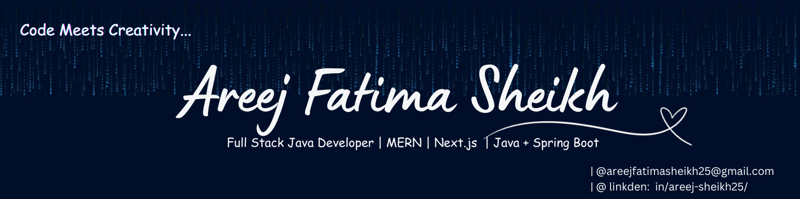

  

<h3> Full Stack Developer | MERN | Next.js | Java + Spring Boot </h3>
Hi, I’m Areej Sheikh, a Full Stack Developer proficient in the MERN stack along with Tailwind CSS, GSAP, and Next.js.  

 💻Currently working on: Developing scalable, user-centric web applications that combine intuitive design with robust functionality, while exploring backend solutions with Java + Spring Boot  

## 👩‍💻 About Me  
- 🔭 Currently working on Building applications with Java + Spring Boot to strengthen backend skills  
- 🌱 Learning **backend development, frameworks & databases**  
- 👯 Open to collaborate on **open-source projects & dynamic web apps**  
- 🤔 Seeking help with **advanced React, Express & integrations**  
- 💬 Ask me about **Frontend, animations (GSAP, Locomotive), and starting web dev**  
- 📫 Reach me: **[Gmail](areejfatimasheikh25@gmail.com)**  |  **[LinkedIn](https://linkedin.com/in/areej-sheikh5274)**  
- ⚡ Fun fact: ☕ Coffee fuels my coding sessions — the stronger, the better!
- 📚 An avid reader who enjoys tech blogs and staying up-to-date with web trends.
- 👨‍💻 Here is a link to My Portfolio - **[Portfolio](https://portfolio-6gxjsq8b1-areej-fatima.vercel.app/)**

---

## 🛠️ Tech Stack  

  
    

  

---
# 📊 GitHub Stats:

